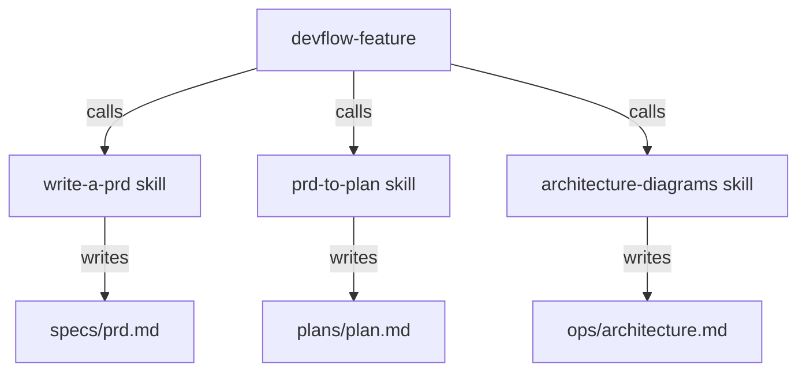
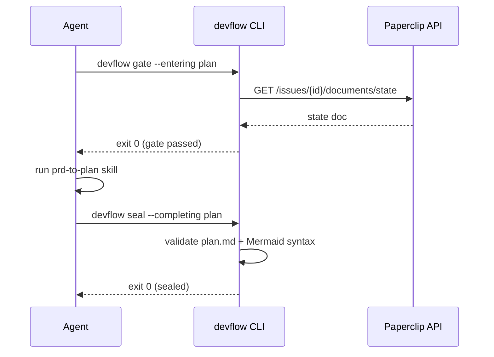

# Architecture Diagrams

Produces `ops/architecture.md` for the current feature. Called by `devflow-feature` during the Plan phase, after `plans/plan.md` is written.

## When to run

- After `prd-to-plan` has produced `plans/plan.md`
- When `devflow seal --completing plan` fails with a Mermaid diagram count or syntax error
- When the user explicitly requests architecture documentation

## Inputs

Read these before drawing anything:

1. `specs/prd.md` — Acceptance Criteria + Scope (what the system must do)
2. `plans/plan.md` — Phases (what will be built) and Verification Commands
3. Existing codebase — understand current module structure before proposing changes

## Required diagrams

Every `ops/architecture.md` must contain **at least two** of the following diagram types. Choose the types that best explain the design:

| Type | When to use |
|---|---|
| Component / module diagram | Always — shows which modules exist and their relationships |
| Sequence diagram | When there are async flows, API calls, or multi-step interactions |
| Data flow diagram | When data transformation or ETL is central to the design |
| State diagram | When the feature has meaningful lifecycle states |
| Entity-relationship diagram | When new database schema or relationships are introduced |

If fewer than 2 diagram types are genuinely applicable (e.g. a trivial config-only change), add an `## Diagrams — N/A` section explaining why. `devflow seal` will accept this as a valid waiver path.

## Process

### Step 1: Identify components

From the plan and codebase, list:
- New modules / files being created
- Existing modules being modified
- External services or APIs being called
- Data stores being read or written

### Step 2: Choose diagram types

Pick the 2+ types that will be most useful for a reviewer reading the plan cold. Prefer the component diagram + one interaction diagram for most features.

### Step 3: Draw diagrams

Use standard Mermaid syntax. Each diagram must be in a fenced ` ```mermaid ` block.

**Component diagram example:**


**Sequence diagram example:**


### Step 4: Validate syntax

After writing each diagram, verify the syntax is valid Mermaid. Common errors:
- Unmatched quotes or parentheses in node labels
- Using `->` instead of `-->` in sequence diagrams
- Missing `graph` direction keyword (`TD`, `LR`, `RL`)

If `mmdc` is available locally, run: `mmdc --input <diagram.mmd> --output /dev/null`

### Step 5: Write the artifact

Write `ops/architecture.md` (relative to the feature root). Overwrite on each run.

## Output artifact: `ops/architecture.md`

```markdown
# Architecture: <feature-slug>

**Timestamp:** <ISO 8601>
**Plan source:** plans/plan.md

## Component Overview

<1–3 sentence description of the overall design and key components>

## Diagrams

### <Diagram Type 1 title>

```mermaid
<diagram source>
```

### <Diagram Type 2 title>

```mermaid
<diagram source>
```

## Design Decisions

- <Why this structure was chosen over alternatives>
- <Key tradeoffs>
- <Any ADR references from plans/plan.md>
```

Fill every section. Do not leave placeholder text in the final file.

## Seal validation

`devflow seal --completing plan` checks:
- ≥ 2 ` ```mermaid ` blocks, OR an `## Diagrams — N/A` section is present
- If `mmdc` is available: each diagram block passes `mmdc` syntax check

If seal fails on diagram count or syntax: fix the diagram(s) and re-run seal. Do not add placeholder blocks to pass the count check — each diagram must describe a real design concern.

If diagrams are genuinely not applicable, use `devflow seal --completing plan --waive-diagrams` and record the reason in `plans/plan.md` under a `## Diagrams — N/A` section.
